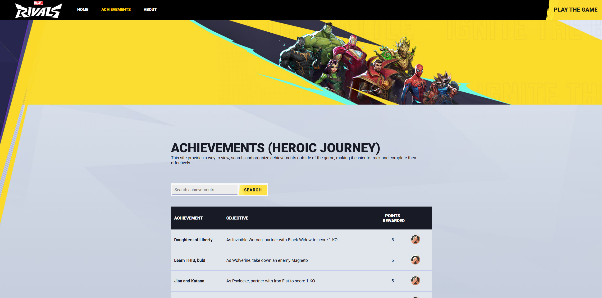
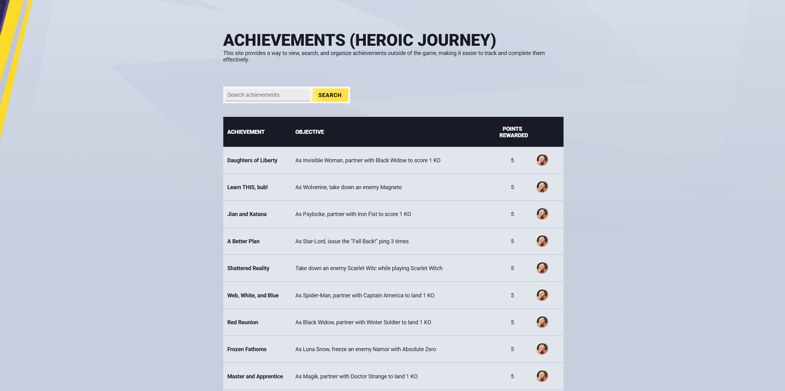
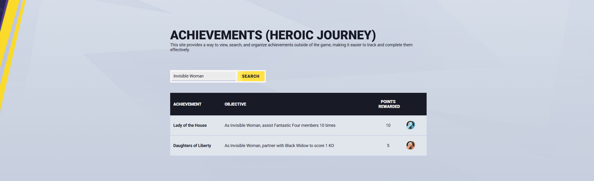

# Heroic Journey Achievement Viewer
This Node.js application provides a website for viewing Marvel Rivals achievements. It uses EJS templates for rendering web pages and is backed by a MongoDB database that stores achievements for characters in the game. Here is a preview of the home page:


## Problem Solved
In Marvel Rivals, players face the inconvenience of not being able to easily search for achievements in-game or view achievements while playing a character. This application addresses that issue by allowing players to view which characters have which achievements in a simple, searchable interface.

## Features
* **Character Achievement Viewer**: Easily search and view achievements based on character, location or objective.
* **In-Game View**: View achievements while playing a character with a website on the side, solving the problem of not being able to access this information during a match.

Here is a preview of the achievement viewer when it fetches everything:


And here is a preview of the achievement viewer when it filters by character:


## Data Extraction ad Database Population
To populate the database:
1. **Extracting Data**: You can use the [extract-to-csv.js](extract-to-csv.js) script to extract achievement data from an HTML table such as this [Game Rant](https://gamerant.com/marvel-rivals-all-heroic-journey-achievements-rewards-skins/) and convert it into a CSV format.
2. **Uploading to MongoDB**: Once the data is in CSV format, use the [upload-to-mongodb.js](upload-to-mongodb.js) script to populate the MongoDB database with the achievement information.

After the database is populated, you can use the website to search and view achievements for your Marvel Rivals characters.

## Setup
1. **Clone the repository**:
```bash
git clone <repository-url>
cd <repository-folder>
```

2. **Install dependencies**:
```bash
npm install
```

3. **Start the application**:
```bash
npm start
```

The application should now be running on `http://localhost:3000/achievements` by default.